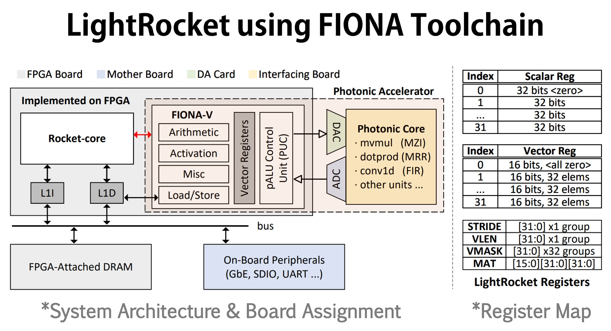
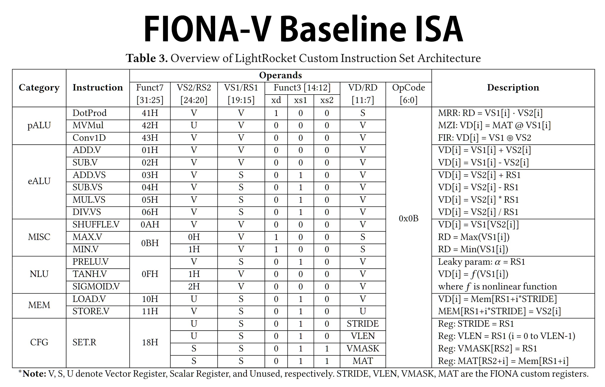

# FIONA-SpikeSim: Functional ISA Simulation with Photonic Instructions

[](https://github.com/hkust-fiona/) 
[](https://iccad.com/)
[](https://github.com/hkust-fiona/fiona-spikesim/LICENSE)

🎉Welcome to the **FIONA SpikeSim** repository!   
🎯This sub-project is an integral part of the [FIONA-Toolchain](https://github.com/hkust-fiona/) and aims to provide a functional instruction set architecture (ISA) simulator that enables photonic-electronic collaborative operations, extended from RISC-V ecosystem. Based on the [Spike](https://github.com/riscv-software-src/riscv-isa-sim), we have implemented the baseline FIONA-V of **LightRocket** demonstration in this repo, as proposed in our paper. 



Researchers can handily add their own photonic instructions based on their designed photonic accelerators exported from the sibling sub-project [FIONA-Photonic](https://github.com/hkust-fiona/fiona-photonic). Additionally, researchers in the field of heterogeneous compilation can use it to test their compilation design for photonics and further explore the relationship among ISA, compiler, and simulator without painfully mastering the hardware details as a prerequisite.



## Prepare the Environment for SpikeSim

```bash
conda create -n spike_py python=3.10
conda env config vars set LD_LIBRARY_PATH=$HOME/mambaforge/envs/spike_py/lib -n spike_py
```

Clone the current repo, make sure that `$RISCV` points to root path of toolchains, and `FIONA_PHOTONIC_DIR` points to the repo of `fiona-photonics` model:

```bash
git clone https://github.com/hkust-fiona/fiona-spikesim
git clone https://github.com/hkust-fiona/fiona-photonic
export FIONA_PHOTONIC_DIR="<path/to/fiona-photonic>"
```

Then run the configuration of SpikeSim:

```bash
cd fiona-spikesim/
mkdir build && cd build
../configure --prefix=$RISCV
```

## Modify FIONA-V Baseline ISA in SpikeSim

To modify the extension, go to `./customext/fiona.cc`. After doing so, please remember to go to `./build` directory and run 

```
make && make install
```

⚠️**The changes won't come into effect if you don't "make install" them!**

To run the test with proxy-kernel [riscv-pk](https://github.com/riscv-software-src/riscv-pk), use:

```
spike --extension=fiona pk <test-elf>
```

For more ELF workloads, please kindly refer to the sibling project [FIONA-Workload](https://github.com/hkust-fiona/fiona-workload). It provides a bundle of hand-tuned kernels and applications of deep neural networks. These workloads can run on either *SpikeSim* or *Verilator* in a bare-metal mode.

## Troubleshooting during Development

If error *"couldn't find shared library either 'libfiona.so' or 'libcustomext.so'"* occurs, check your `LD_LIBRARY_PATH` env variable. Make sure it includes `$RISCV/lib`. It is suggested to add the following line to your `.bashrc` or `.zshrc`:

```
export LD_LIBRARY_PATH=$LD_LIBRARY_PATH:$RISCV/lib
```

## Citations
🎓Please cite the following paper if you find this work useful:

> Yinyi Liu, Bohan Hu, Zhenguo Liu, Peiyu Chen, Linfeng Du, Jiaqi Liu, Xianbin Li, Wei Zhang, Jiang Xu. **FIONA: Photonic-Electronic Co-Simulation Framework and Transferable Prototyping for Photonic Accelerator.** In *2023 IEEE/ACM International Conference on Computer-Aided Design (ICCAD).* IEEE, 2023.

## Acknowledgements
❤️I would like to express my sincere gratitude and appreciation to several organizations for their invaluable contributions to my work. Without their support, this endeavor would not have been possible:

|**Organizations**|**Supports**|
|---|---|
|[University Grants Committee (Hong Kong)](https://www.ugc.edu.hk/eng/ugc/index.html)|Research Funds|
|Guangzhou-HKUST(GZ) Joint Funding Program|Research Funds|
|[RISC-V Community & all Contributors](https://github.com/riscv-software-src)|Open-source Projects|
